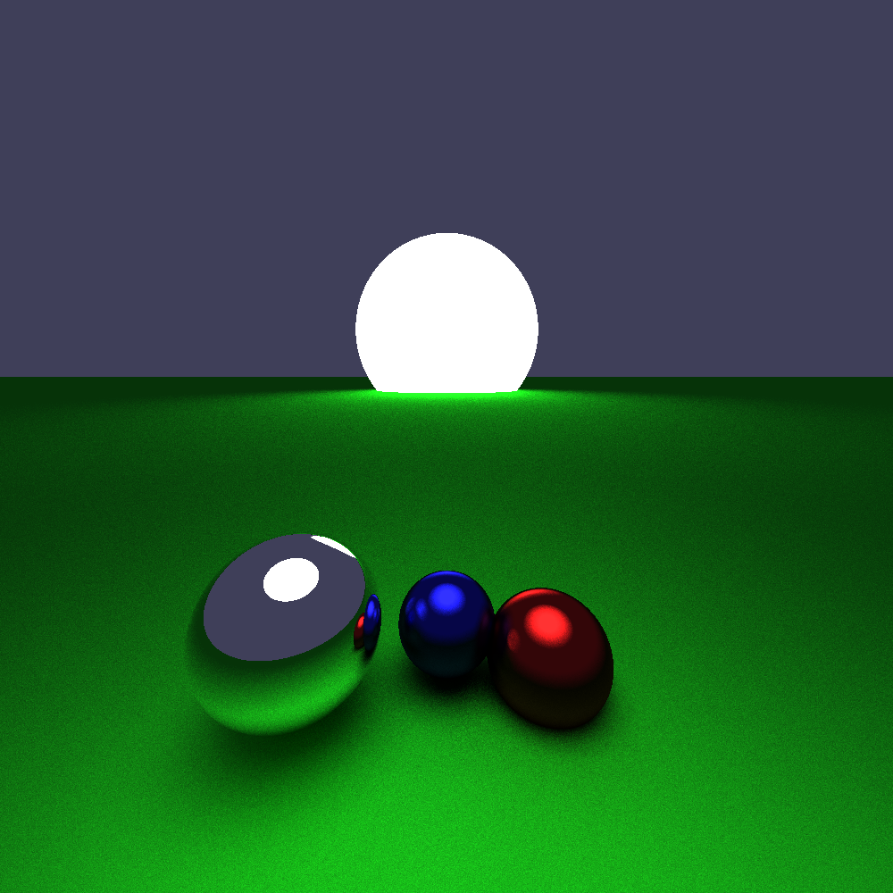
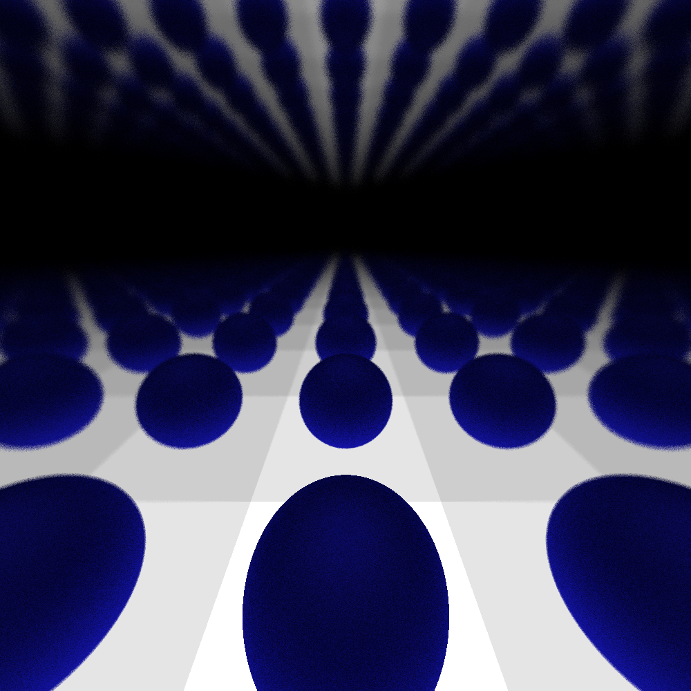

# Raytracer

This is a simple raytracer written in C++. It loads a scene and renders it to a ppm file.

### Usage
To build it you'll need cmake and a C++ compiler. Then run:
```
cmake -S . -B .build && make -C .build
```

To run it:
```
./raytracer <scene_file> > <image_name>.ppm
```
### Features
- [x] Sphere
- [x] Plane
- [x] Point light
- [x] Directional light
- [x] Shadows
- [x] Reflections

### Examples
The files are in the .doc folder.



### Scene file format
The scene file is a simple text file in the .yamete extentions with the following format:
```
# Configuration of the camera
camera :
{
    resolution = { width = 1920; height = 1080; fov: 80;};
    position = { x = 0; y = -100; z = 20; };
    rotation = { x = 8; y = 45; z = 1; };
};
# Primitives in the scene
primitives :
    {
    # List of shapes
    shapes = (
        {
            type = "Sphere";
            position = {
                x = 0;
                y = 0;
                z = 0;
            };
            material = {
                r = 255;
                g = 64;
                b = 64;
            };
            translate = {
                x = 0;
                y = 0;
                z = 0;
            };
            radius = 10;
        }
    );
    plane : {
        axis = "Z";
        position = -20;
        color = {
            r = 64;
            g = 64;
            b = 255;
            };
        }
};

# List of lights
lights = (
    {
        type = "Point";
        position = {
            x = 0;
            y = 0;
            z = 20;
            };
        intensity = 1;
        },
    {
        type = "Directional";
        position = {
            x = 0;
            y = 0;
            z = 20;
        };
        intensity = 1;
    }
);
```
Note that the camera is the only needed field, the rest is optional.
You can have a black screen.
The yamete extensions stands for "Yet Another Meme Extension To Everything" and is a joke.
